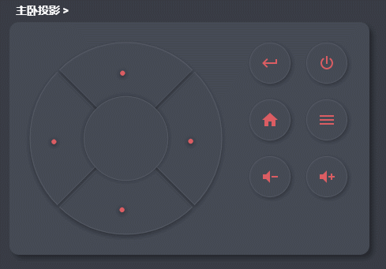

lovelace-remote-card
================================================

[](https://github.com/custom-components/hacs)

This is a universal TV (set-top box) remote control card that can be customized with extra buttons



## Usage

!> Note: only supported script

Add this card to your Yaml or UI editor
```yaml
type: 'custom:lovelace-remote-card'
vibrate: true
entity: binary_sensor.tian_mao_mo_he
circle:
  ok: script.yao_kong_select
  up: script.yao_kong_up
  down: script.yao_kong_down
  left: script.yao_kong_left
  right: script.yao_kong_right
right_buttons:
  - entity: script.chuang_wei_dian_shi_kai_guan
    icon: 'mdi:monitor'
  - entity: script.tian_mao_mo_he_kai_guan
    icon: 'mdi:set-top-box'
  - entity: script.yao_kong_power_on
    icon: 'mdi:power'
  - entity: script.yao_kong_back
    icon: 'mdi:keyboard-return'
  - entity: script.yao_kong_home
    icon: 'mdi:home'
  - entity: script.yao_kong_menu
    icon: 'mdi:menu'
  - entity: script.yao_kong_volume_down
    icon: 'mdi:volume-minus'
  - entity: script.yao_kong_volume_up
    icon: 'mdi:volume-plus'
```

Xiaomi TV Remote Control
```yaml
type: 'custom:lovelace-remote-card'
vibrate: true
entity: media_player.xiao_mi_dian_shi
circle:
  ok: 
    service: remote.send_command
    data:
      command: enter
      entity_id: remote.xiao_mi_dian_shi
  up: 
    service: remote.send_command
    data:
      command: up
      entity_id: remote.xiao_mi_dian_shi
  down: 
    service: remote.send_command
    data:
      command: down
      entity_id: remote.xiao_mi_dian_shi
  left: 
    service: remote.send_command
    data:
      command: left
      entity_id: remote.xiao_mi_dian_shi
  right: 
    service: remote.send_command
    data:
      command: right
      entity_id: remote.xiao_mi_dian_shi
right_buttons:
  - icon: 'mdi:power'
    service: remote.send_command
    data:
      command: power
      entity_id: remote.xiao_mi_dian_shi
  - icon: 'mdi:keyboard-return'
    service: remote.send_command
    data:
      command: back
      entity_id: remote.xiao_mi_dian_shi
  - icon: 'mdi:home'
    service: remote.send_command
    data:
      command: home
      entity_id: remote.xiao_mi_dian_shi
  - icon: 'mdi:menu'
    service: remote.send_command
    data:
      command: menu
      entity_id: remote.xiao_mi_dian_shi
  - icon: 'mdi:volume-minus'
    service: remote.send_command
    data:
      command: volumedown
      entity_id: remote.xiao_mi_dian_shi
  - icon: 'mdi:volume-plus'
    service: remote.send_command
    data:
      command: volumeup
      entity_id: remote.xiao_mi_dian_shi
```
## Attributes

> 
Note: only supported script

- `circle`
  * `up` 
  * `down`
  * `left`
  * `right`
  * `ok`
- `right_buttons` Right button supports `script` Any number can be added, but 6 or 8 are recommended for UI harmony. The format is strictly according to the example
- `bottom_buttons` The bottom button supports `script`, you can add any number, but it is recommended to have 6 or 8, for the harmony of the UI. The format is strictly according to the example
- `vibrate` (Option) Set whether the button vibration feedback is enabled True/False
- `entity` (Option) You can specify the tracking ID of the device, usually router tracking, to determine whether the TV is online